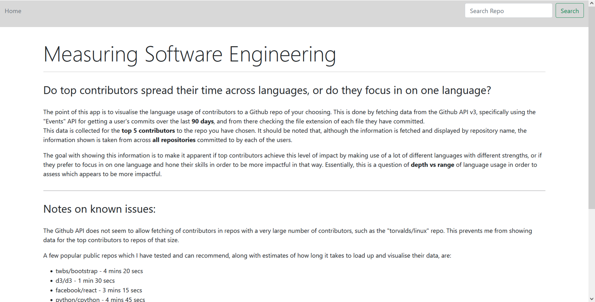
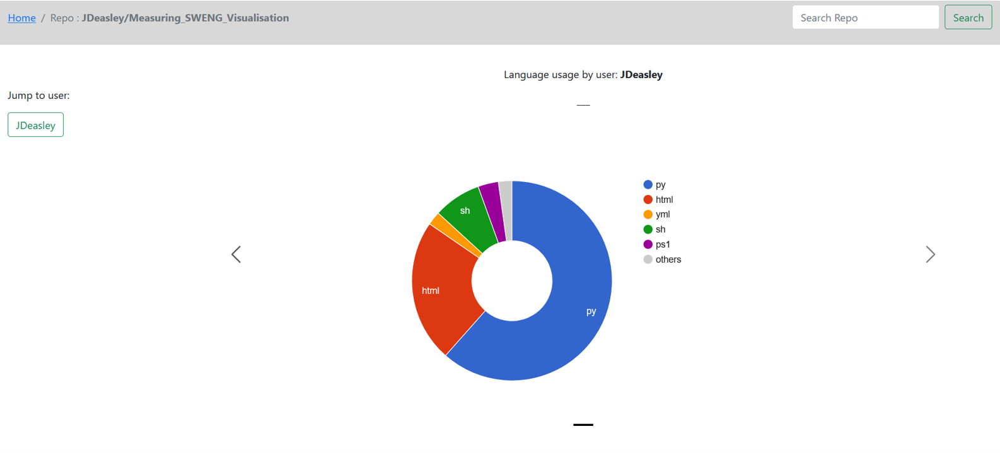
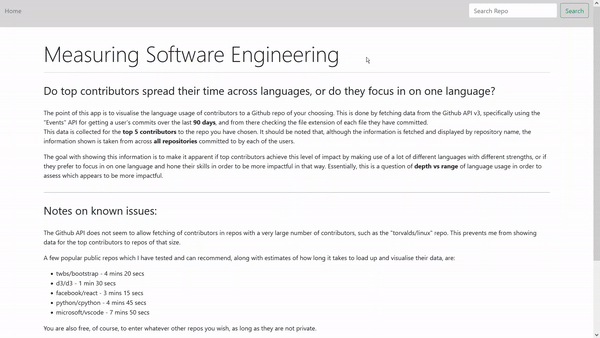

# Measuring_SWENG
Software Engineering module Measuring Software Engineering project repo.

## Dependencies
On your machine, to run the Docker containers which run the app, you will need:
- Docker (and Docker-Compose)

Other dependencies, which you need not worry about as they are handled by Docker, are as follows:
- Python (and pip)
- Flask
- PyGithub
- pymongo

## Usage
Once setup has been completed and the app started, the app can be found on `localhost:5000` in your web browser.

Usage is as simple as typing in your desired repo to the search bar in the top right corner of the webapp.

Loading times can range from as little as a few seconds up to several minutes depending on the number of contributions the repo's top contributors have made, so please bear with that. Some examples of loading times just for your reference are as follows:

- twbs/bootstrap - 4 mins 20 secs
- d3/d3 - 1 min 30 secs
- facebook/react - 3 mins 15 secs
- python/cpython - 4 mins 45 secs
- microsoft/vscode - 7 mins 50 secs

I realise some of these are quite long waits, but generally speaking, smaller repos are reasonable, considering the data is being loaded on the fly.

## Setup

(__Note:__ The setup instructions below can all be executed automatically by running the `run.sh` script, however there are only 3 steps, so I would recommend doing it manually to ensure no errors can come from running shell scripts, as I am not very well-versed in writing shell scripts.)

Within the same directory as the 'docker-compose.yml' file:

1. Create a `.env` file containing a Github API key with the name `GITHUB_PAT`.
2. Create an empty `data` directory for the mongo database to work from.

After this, the application and database are fully Dockerized, so all you'll need to do is: 

3. Enter the command `docker-compose up` from the directory containing the `docker-compose` file.

Wait a few seconds and the app will appear on `localhost:5000`.

## Images

When you first open the app on localhost:5000, you will see the __home page__ with a short description of the project as well as a search bar for choosing a repo to visualise data for.

----

You can then use the search bar in the top right to enter the name of a repo of your choosing, e.g. JDeasley/Measuring_SWENG_Visualisation or d3/d3, and you will then (after a bit of loading) be taken to a __visualisation__ for that repo.

----

The gif below demonstrates usage of the app.

